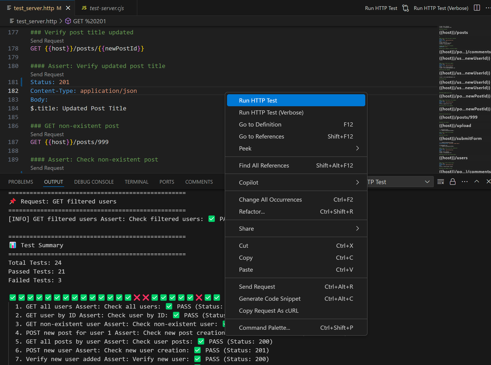

# http-test

http-test is a powerful and user-friendly API testing library that allows you to easily write and execute API tests using simple .http files. With http-test, you can streamline your API testing process and ensure the reliability of your endpoints without writing complex test scripts.

## VS Code Extension

For an even easier experience, use the [http-test VS Code Extension](https://marketplace.visualstudio.com/items?itemName=iyulab.http-test). This extension provides seamless integration with Visual Studio Code, allowing you to run and manage your http-test files directly from the editor.



## Features

- Write tests in easy-to-read .http files
- Support for various HTTP methods (GET, POST, PUT, DELETE, PATCH)
- Automatic assertion based on status codes
- Custom assertions for headers, body content, and more
- Variable management for dynamic request data
- File upload testing support
- Detailed test reports and summaries

## Installation

Install http-test globally using npm:

```bash
npm install @iyulab/http-test -g
```

Once installed, run your tests with:

```bash
http-test path/to/your/tests.http
http-test path/to/your/tests.http --verbose
```

## Writing Tests

http-test uses a simple syntax for defining API tests in .http files:

### Status Code Assertions

Check the status code of the response:

```http
### GET all users
GET {{host}}/users

#### Assert: Check status code
Status: 200
```

### Header Assertions

Assert response headers:

```http
### GET all users
GET {{host}}/users

#### Assert: Check headers
Status: 200
Content-Type: application/json
```

### JSONPath Assertions

Use JSONPath to assert specific values in the response body:

```http
### GET all users
GET {{host}}/users

#### Assert: Check response body
Status: 200
Content-Type: application/json
Body:
$[0].id: 1
$[0].name: John Doe
```

### Setting Variables from Response

Save values from the response to use in subsequent requests:

```http
### POST new user
POST {{host}}/users
Content-Type: application/json

{
  "name": "Alice Johnson",
  "email": "alice@example.com"
}

#### Assert: Check new user creation
Status: 201
Content-Type: application/json
Body:
$.name: Alice Johnson
$.email: alice@example.com

# Save new user ID to variable
@newUserId = $.id
```

### Custom Assertions with Scripts

Write custom JavaScript functions for complex validations:

```javascript
// custom-assert.js
module.exports = function(response, context) {
  const body = typeof response.data === 'string' ? JSON.parse(response.data) : response.data;

  if (body.id !== context.variables.newUserId) {
    throw new Error("User ID mismatch");
  }

  if (!body.email.includes('@')) {
    throw new Error("Invalid email format");
  }
};
```

Use the custom assertion in your .http file:

```http
### Custom Assert user verification 
GET {{host}}/users/{{newUserId}}

#### Assert: Verify user format
Status: 2xx
_CustomAssert: ./custom-assert.js
```

### File Uploads

Test file uploads using `multipart/form-data`:

```http
### Upload file
POST {{host}}/upload
Content-Type: multipart/form-data; boundary=---boundary
Content-Disposition: form-data; name="file"; filename="example.txt"

This is the content of the file.
```

### Using External Variable Files

Manage variables using a `variables.json` file:

```json
// variables.json
{
  "host": "http://localhost:3000",
  "token": 123
}
```

Reference these variables in your .http test files:

```http
@host = http://localhost:3000

### GET all users
GET {{host}}/users
```