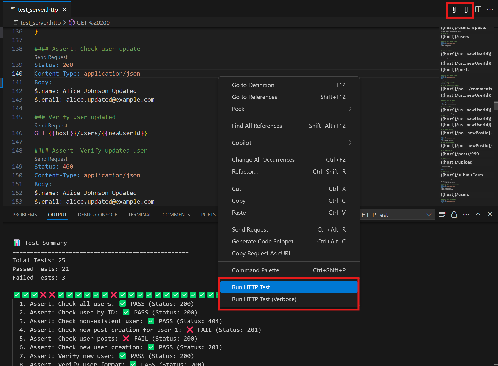

# http-test VS-Tool

http-test VS-Tool is a Visual Studio Code extension that makes it easy to use the [@iyulab/http-test](https://github.com/iyulab-rnd/http-test) library directly within your VS Code environment.

## Features

- Run HTTP tests on .http files
- Quick test execution via context menu
- Real-time test results in VS Code's output panel

## Screenshot

## Requirements

- Node.js must be installed ([Download Node.js](https://nodejs.org))

## How to Use

1. Open a .http file
2. Right-click within the file to open the context menu
3. Select the "Run HTTP Test" option
4. View the test results in the output panel

## Keyboard Shortcut

- Windows/Linux: `Ctrl+Alt+T`
- macOS: `Cmd+Alt+T`

## About @iyulab/http-test Library

This extension is built on top of the [@iyulab/http-test](https://github.com/iyulab-rnd/http-test) library. This library is a powerful tool for easily testing HTTP requests.

Key features:
- Support for HTTP methods (GET, POST, PUT, DELETE, etc.)
- Variable support
- Response validation
- JSON schema validation
- Environment configuration

For more details, please refer to the [@iyulab/http-test GitHub repository](https://github.com/iyulab-rnd/http-test).

## Installation

1. Open VS Code
2. Open the Extensions marketplace (Ctrl+Shift+X)
3. Search for "http-test VS-Tool"
4. Click the "Install" button
